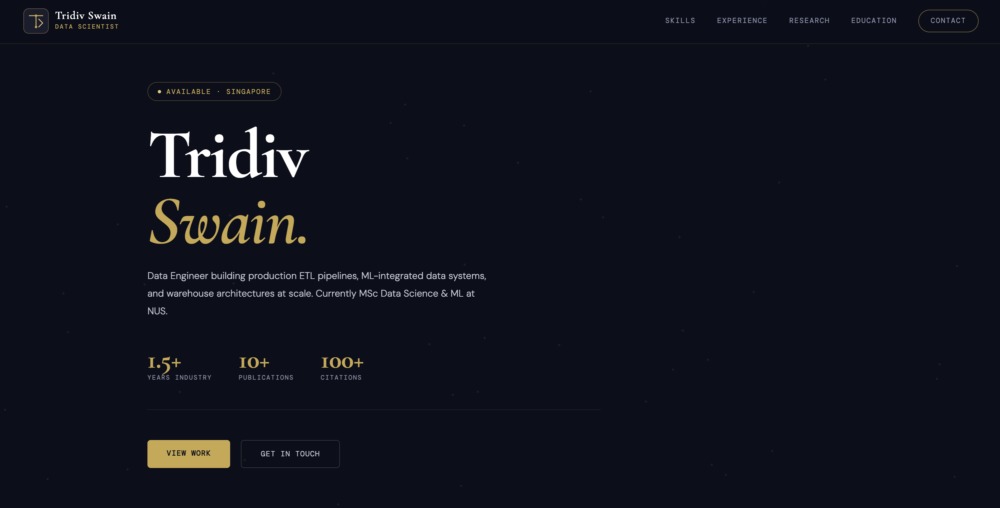

# Tridiv Swain — Portfolio Website

> Personal portfolio of **Tridiv Swain**, Data Engineer · Singapore  
> Built with vanilla HTML, CSS & JavaScript — no frameworks, no dependencies.

[](https://virtual41tridiv.github.io/tridiv.portfolio)
[](LICENSE)

---

## Preview



---

## About

A fully custom, single-file portfolio site designed around a **deep navy × warm gold** aesthetic with an animated neural-network particle background — a nod to the data science and ML work that defines my career.

Sections covered:
- **Hero** — introduction, key stats, and CTAs
- **Skills** — categorised tech stack with visual tags
- **Experience** — timeline of roles at PwC India and HighRadius
- **Research** — selected publications with citation counts
- **Education** — NUS MSc (current) and KIIT B.Tech
- **Contact** — links to LinkedIn, GitHub, Google Scholar, and portfolio

---

## Tech Stack

| Layer | Choice |
|---|---|
| Markup | HTML5 |
| Styling | CSS3 (custom properties, grid, flexbox, animations) |
| Interactivity | Vanilla JavaScript (Canvas API for particle network) |
| Fonts | Cormorant Garamond · DM Sans · DM Mono (Google Fonts) |
| Hosting | GitHub Pages |

No build tools. No npm. No frameworks. Just one `index.html`.

---

## Design Highlights

- **Animated particle canvas** — gold-toned neural network nodes in the background
- **Custom SVG logo mark** — geometric `TS` monogram with data-flow chevron
- **Infinite skill ticker** — scrolling tech stack banner
- **Gold timeline** — glowing node markers on the experience section
- **Responsive** — mobile-friendly layout with collapsing nav

---

## Local Development

No setup needed. Just open the file:

```bash
git clone https://github.com/virtual41tridiv/tridiv.portfolio.git
cd tridiv.portfolio
open index.html        # macOS
# or
start index.html       # Windows
```

---

## Deploying Changes

```bash
git add index.html
git commit -m "Update portfolio"
git push
```

GitHub Pages auto-deploys on every push to `main`. Changes go live in ~60 seconds.

---

## Connect

| Platform | Link |
|---|---|
| LinkedIn | [tridiv-swain-26ai09](https://www.linkedin.com/in/tridiv-swain-26ai09/) |
| GitHub | [virtual41tridiv](https://github.com/virtual41tridiv) |
| Google Scholar | [Publications](https://scholar.google.com/citations?user=7Vpgk4MAAAAJ&hl=en) |
| Medium | Data Science · AI · Quantum Computing |

---

<p align="center">Designed & built by Tridiv Swain · Singapore · 2025</p>
