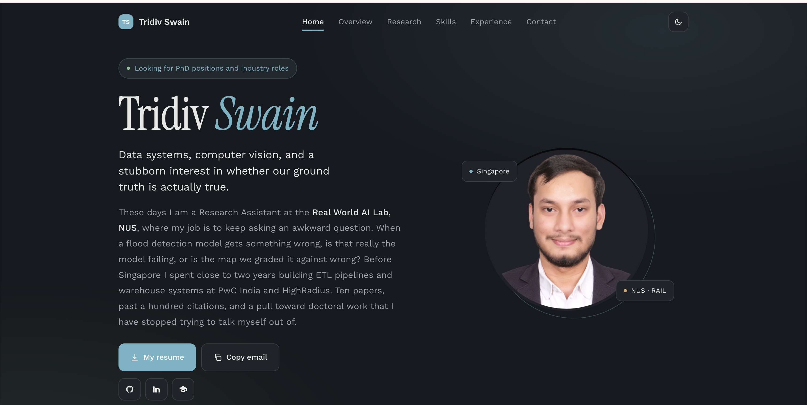

# Tridiv Swain · Portfolio

Research Assistant at the Real World AI Lab, NUS. Data engineering before that.
One HTML file, no frameworks, no build step, no dependencies.

[](https://virtual41tridiv.github.io/tridiv.portfolio)
[](LICENSE)

## Preview



## Design notes

The whole page sits on a soft warm off-white, with a light tinted hero rather than a dark one.
Instrument Serif sets the headings, Work Sans carries everything else, and IBM Plex Mono is kept
to tech tags and leaf metadata. Accents are five muted tones (teal, sage, tan, dusty blue, rose)
assigned per section, so the sections stay distinguishable without competing for attention.

### The Overview map

Section 01 is a hierarchy diagram. One root node branches into Experience, Skills and Research,
and each branch drops into a chain of leaf cards.

The connectors are an SVG overlay that measures the real position of every node and generates the
paths, rounded elbows included. Because the geometry comes from live measurements it reflows at
any width, and it detects the single column mobile layout and rewires itself into one continuous
chain instead. Rebuilds run on `requestAnimationFrame` via a `ResizeObserver`.

The root node is centred over the branches and the wires fan out symmetrically. When the section
first scrolls into view the wires draw themselves in, staggered by depth, and a thin pulse of
current then runs along each one continuously. Pulse duration is derived from each wire's own
length, so the current travels at one steady speed no matter how long the segment is.

Wire colours are set from the **inline** `--k` declaration rather than the computed value, which
keeps them as a literal `var(--cy)` so they repaint correctly when the theme is switched.

### Motion

Deliberately restrained. What moves is:

- a short fade and rise as elements scroll into view
- the hierarchy wires drawing in once, then carrying a soft travelling pulse
- the three counters in the hero strip counting up once
- ordinary hover and focus transitions

That is the only looping animation on the page. Everything respects `prefers-reduced-motion`,
which removes the lot.

### Section aware text selection

Each section sets a `--sel` custom property that `::selection` reads, so highlighted text picks
up a soft tint of whichever section it sits in, and branches and timeline entries override it
with their own accent.

### Other features

Theme persisted to `localStorage` and defaulting to the OS setting, a scroll progress bar, a nav
that goes solid past the fold with active section tracking, a copy email button with a
confirmation state, and a back to top control.

`tridiv.png` is cropped to the face circle purely in CSS, so one source file serves the hero
portrait and the map root node without any image editing. The crop is circular because the source
has a black backdrop, and a square crop would show its corners against the light page.

## Sections

| # | Section | Contents |
|---|---|---|
| 01 | Overview | Hierarchy map linking experience, skills and research |
| 02 | Research | Featured flood mapping work, doctoral direction, four selected papers |
| 03 | Skills | Six grouped cards, including computer vision and generative models |
| 04 | Experience | Six entry timeline, RAIL through to KIIT |
| 05 | Contact | Details, socials, and a form that opens a prefilled mail draft |

## Stack

| Layer | Choice |
|---|---|
| Markup | HTML5 |
| Styling | CSS custom properties, grid, `color-mix`, `backdrop-filter` |
| Interactivity | Vanilla JS, `IntersectionObserver`, `ResizeObserver` |
| Fonts | Instrument Serif · Work Sans · IBM Plex Mono |
| Hosting | GitHub Pages |

## Local development

Open `index.html` in a browser, or serve the folder so the portrait resolves:

```bash
python3 -m http.server 4173
```

## Deploying

```bash
git add index.html README.md .gitignore && git commit -m "Update portfolio" && git push
```

GitHub Pages redeploys on every push to `main`. Live in about a minute.

## Editing content

Everything is in `index.html`.

- **Colours** are CSS variables in the `:root` and `html[data-theme="night"]` blocks. The hero
  keeps its own fixed dark palette in the `--h-*` variables, so it looks the same in both themes
- **Card and branch accents** are set inline with `style="--k:var(--cy)"` and friends. The
  selection colour follows `--k` automatically wherever a block sets `--sel:var(--k)`
- **Adding a timeline entry** means copying one `.stop` block. The spine remeasures on load and
  on resize, so nothing else needs touching
- **Adding a branch to the map** means copying a `.limb` block and updating
  `grid-template-columns` on `.limbs`. The distribution bar formula adapts to the new count if
  you change the `3` in the `calc`
- **The hero tint** is the two `radial-gradient` layers on `.hero`. Drop their percentages to
  flatten it further, or remove them for a plain background

## Connect

| Platform | Link |
|---|---|
| LinkedIn | [tridiv-swain-26ai09](https://www.linkedin.com/in/tridiv-swain-26ai09/) |
| GitHub | [virtual41tridiv](https://github.com/virtual41tridiv) |
| Google Scholar | [Publications](https://scholar.google.com/citations?user=7Vpgk4MAAAAJ&hl=en) |
| Email | tridivswain.india2@gmail.com |
